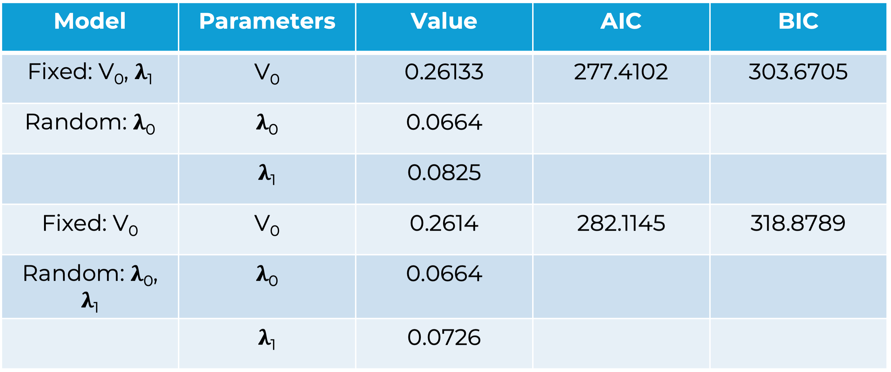

&nbsp;

<h1 style="text-align: center;"> BMC-BAMC '25, University of Exeter </h1>

<h2 style="text-align: center;"> Abstract </h2>

Translating findings from pre-clinical to clinical drug trials remains a significant challenge in pharmacology. The main issue is that most pre-clinical studies rely on mouse xenograft models, whereas clinical trials are conducted in humans, where tumours exhibit greater structural constraints and biological differences. A key step toward improving this translation is developing a robust mathematical understanding of pre-clinical trials outcomes, which can enhance predictive modelling, refine drug development strategies, and reduce reliance on animal models.
 
In this study, we analyse tumour growth data from patient-derived xenograft (PDX) models used in pre-clinical trials of small-molecule cytotoxic chemotherapy. The dataset [3] includes longitudinal tumour volume measurements across multiple cancer types capturing both untreated tumour growth and responses to various drug treatments. To characterise tumour growth dynamics, we fit non-linear mixed effects mechanistic tumour growth models for empirical growth laws that account for inter-tumour variability and treatment effects.
 
Beyond model fitting, we explore optimal dosing strategies for small-molecule drugs by integrating our models with RECIST (Response Evaluation Criteria in Solid Tumours)-based response criteria, a set of guidelines used to assess the response of cancer patients to treatment for nutrient diffusion models. Our findings contribute to a deeper understanding of pre-clinical tumour growth patterns and provide a framework for improving dose optimisation, an important step in mathematical oncology. Longer term, this project, in collaboration with GlaxoSmithKline (GSK), aims to establish mechanistic modelling approaches incorporating spatial, pharmacokinetic and pharmacodynamic (PKPD) effects to create models that are fit-for-use in drug development.

---

<h2 style="text-align: center;"> Non-linear Mixed Effects Framework </h2>

As part of the ongoing PDX data analysis, a nonlinear mixed-effects (NLME) modeling approach was employed using the exponential-linear tumor growth model. Two hierarchical models were evaluated, differing in the specification of their random effects. In the first model, inter-subject variability was incorporated only on the exponential growth rate parameter ($$\lambda_0$$). In the second model, random effects were included on both the exponential ($$\lambda_0$$) and linear ($$\lambda_1$$) growth rate parameters to capture variability across subjects more comprehensively. The figure presents the model fits to the PDX data under the NLME framework, with results stratified by tumor type.

The table below compares the two models and gives an estimate for the parameters used in the exponential-linear growth law: 

Statistical analysis revealed that the p-value was significant only for Model 1, which includes the exponential growth rate ($$\lambda_0$$) as the sole random effect. This finding suggests that, during the course of the preclinical trial, tumor growth predominantly follows an exponential trajectory without transitioning to the linear (vascular) growth phase. This observation supports the hypothesis that tumors remain in the avascular stage throughout the study period. Such a growth pattern is consistent with early termination of the experiment, which is typically guided by predefined animal welfare endpoints.

---

<h2 style="text-align: center;"> Bibliography </h2>

[1] Nasim, A., Yates, J., Derks, G. & Dunlop, C. A spatially resolved mechanistic growth law for cancer drug development predicting tumour growing fractions. Cancer Res. Commun. 2, 754–761 (2022).

[2] Deakin, A. S. Model for the growth of a solid in vitro tumor. Growth 39, 159–65 (1975).

[3] Gao, H. et al. High-throughput screening using patient-derived tumor xenografts to predict clinical trial drug response. Nat. Med. 21, 1318–1325 (2015).  

 
 ---

 My profile: [here](https://www.surrey.ac.uk/people/esha-joshi).
