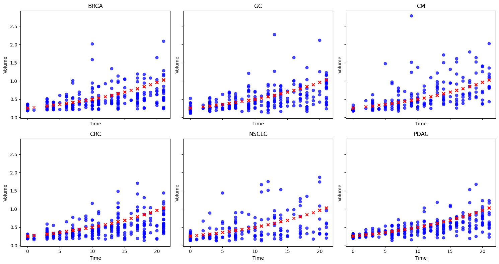


  

&nbsp;

<h1 style="text-align: center;"> BMC-BAMC '25, University of Exeter </h1>

<h2 style="text-align: center;"> Abstract </h2>

Translating findings from pre-clinical to clinical drug trials remains a significant challenge in pharmacology. The main issue is that most pre-clinical studies rely on mouse xenograft models, whereas clinical trials are conducted in humans, where tumours exhibit greater structural constraints and biological differences. A key step toward improving this translation is developing a robust mathematical understanding of pre-clinical trials outcomes, which can enhance predictive modelling, refine drug development strategies, and reduce reliance on animal models.
 
In this study, we analyse tumour growth data from patient-derived xenograft (PDX) models used in pre-clinical trials of small-molecule cytotoxic chemotherapy. The dataset (source: Novartis, open-source dataset) includes longitudinal tumour volume measurements across multiple cancer types capturing both untreated tumour growth and responses to various drug treatments. To characterise tumour growth dynamics, we fit non-linear mixed effects mechanistic tumour growth models for empirical growth laws that account for inter-tumour variability and treatment effects.
 
Beyond model fitting, we explore optimal dosing strategies for small-molecule drugs by integrating our models with RECIST (Response Evaluation Criteria in Solid Tumours)-based response criteria, a set of guidelines used to assess the response of cancer patients to treatment for nutrient diffusion models. Our findings contribute to a deeper understanding of pre-clinical tumour growth patterns and provide a framework for improving dose optimisation, an important step in mathematical oncology. Longer term, this project, in collaboration with GlaxoSmithKline (GSK), aims to establish mechanistic modelling approaches incorporating spatial, pharmacokinetic and pharmacodynamic (PKPD) effects to create models that are fit-for-use in drug development.

---

<h2 style="text-align: center;"> Non-linear Mixed Effects Framework </h2>

In continuation to the PDX data analysis, a non-linear mixed effects framework was applied to the data and the model was fitted using the exponential-linear growth law. Two models were compared where each time, the random effect variable was changed. In the first model, only the exponential growth rate ($\lambda_0$) was considered as a random effect and in the second model, both exponential and linear growth rate ($\lambda_1$) were considered as the radnsom effect. The figure shows the results of the fitting for the PDX data using the non-linear mixed effects framework with the data grouped as per the type of the tumour. 

The table below comapres the two models and gives an estimate for the paramaters used in the expoenntial-linear growth law. 

| Left |  Center  | Right |
|:-----|:--------:|------:|
| L0   | **bold** | $1600 |
| L1   |  `code`  |   $12 |
| L2   | _italic_ |    $1 |
---

<h2 style="text-align: center;"> Add title </h2>

text
 
 ---

 My profile: [here](https://www.surrey.ac.uk/people/esha-joshi).
